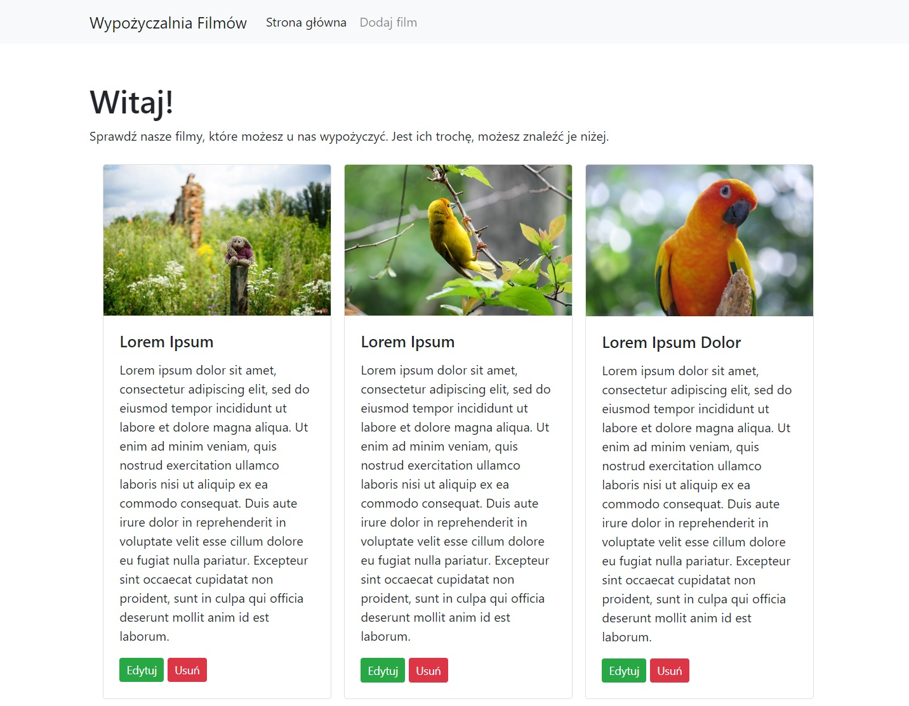

# Wypożyczalnia filmów

Aplikacja umożliwia dodawanie wpisów filmów do bazy wraz z ich okładkami, możliwościami edycji oraz możliwością usunięcia.

Wygląd aplikacja wygląda następująco dla urządzeń **typu PC**:

Dla urządzeń **mobilnych** strona zachowuje się responsywnie, zmieniając układ 3 kolumn na jedną, a w przypadku tabletów na dwie kolumny.

Aplikacja umożliwia dodawanie wpisów z walidacją wpisanej treści. Tak wygląda formularz do dodania nowego wpisu w bazie:

Podczas gdy użytkownik nie poda wszystkich potrzebnych informacji zostanie o tym odpowiednio poinformowany:

Po dodaniu wpisu użytkownik zostaje przekierowany na stronę edycji danego wpisu:

Jeżeli jednak wpis nie spełni wszystkich wymagań, tu również pojawi się komunikat o błędach.

Aby usunąć dany wpis należy kliknąć przycisk usuń, po którego kliniętu pojawi się komunikat wymagający potwierdzenia usunięcia wpisu:

